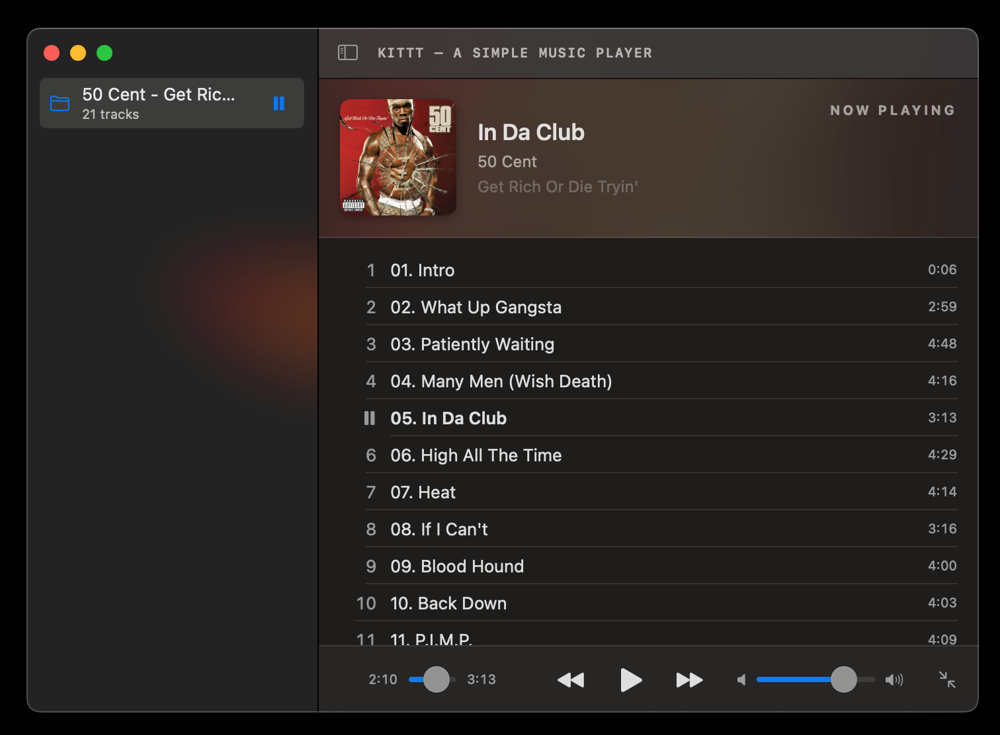
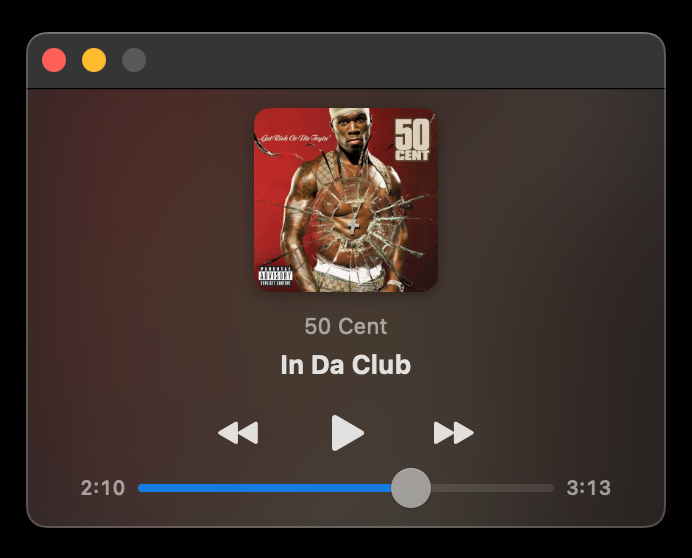

# Kittt

A simple music player for macOS. Tested on Sequoia (macOS 15).

<p align="center">
  
  
</p>

## Download

Grab the latest build from the [Releases](../../releases) page.

### First launch (Gatekeeper warning)

The `.app` is ad-hoc-signed (no Apple Developer ID). The first time you open it, macOS will show:

> *"Kittt" can't be opened because Apple cannot check it for malicious software.*

To allow it: open **System Settings → Privacy & Security**, scroll down to the **Security** section, and click **Open Anyway** next to the message about Kittt. You only have to do this once.

## Or build it yourself

Requirements: macOS 14+ on Apple Silicon, and the Command Line Tools (`xcode-select --install`). No Xcode needed.

```sh
git clone https://github.com/Moh-Said/Kittt.git
cd kittt
./scripts/build-app.sh
open build/Kittt.app
```

For day-to-day iteration without bundling:

```sh
swift run
```

## What it does

- Plays MP3, FLAC, M4A, AAC, WAV, AIFF, ALAC via system frameworks (no bundled decoders).
- Reads embedded metadata — title, artist, album, artwork — from ID3 / Vorbis / iTunes tags. Falls back to `folder.jpg` / `cover.jpg` sidecar files.
- Opens a folder; each immediate subfolder becomes its own playlist in the sidebar.
- Or opens a single file and plays it.
- Mini-player mode (compact resize-locked window) and a full mode.
- Publishes Now Playing info to Control Center and responds to F8 / Bluetooth headset media keys.
- Right-click a sidebar item to remove it from the list.

## Keyboard

- **Space** — play / pause
- **⌘O** — open folder
- **⇧⌘O** — open file
- **⌘← / ⌘→** — previous / next track
- **F7 / F8 / F9** — system media keys (also Bluetooth headset transport, Control Center)

## Note

I'm not a Swift developer. This app was built entirely with the help of AI.

If you like it, take a look at my jj and git learning simulator: **<https://gitor.xyz>**.
